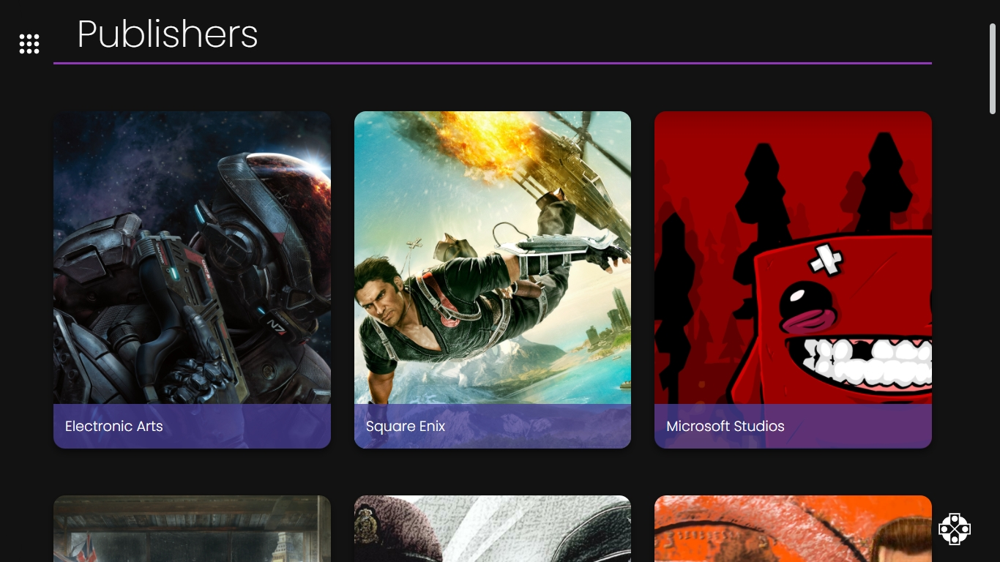

<h1 align="center">Joystick Database</h1>

Olá! Seja bem-vindo ao meu repositório do projeto Joystick Database. O projeto desenvolvimento é um banco de dados completamente voltado aos games, no qual você pesquisar games, acessar suas informações, gêneros, plataformas, publicadoras e muito mais! Este projeto faz uso da API do site <a href="https://rawg.io/apidocs" target="_blank">RAWG.io</a> para buscar todas as informações referentes aos games.

<h2 align="center">:rocket: Tecnologias Utilizadas :rocket:</h2>

  
  
  
  
  

<h2 align="center">:computer: Demonstração do Projeto :computer:</h2>

<h3 align="center">Página Home</h3>

<h3 align="center">Games</h3>

<h3 align="center">Detalhes do game</h3>

<h3 align="center">Ficha técnica do game</h3>

<h3 align="center">Galeria de screenshots</h3>

<h3 align="center">Slideshow dos screenshots</h3>

<h3 align="center">Pesquisando um game</h3>

<h3 align="center">Games populares</h3>

<h3 align="center">Novos games</h3>

<h3 align="center">Jogos a serem lançados</h3>

<h3 align="center">Gêneros</h3>

<h3 align="center">Detalhes do gênero</h3>

<h3 align="center">Jogos referentes ao gênero</h3>

<h3 align="center">Plataformas</h3>

<h3 align="center">Detalhes da plataforma</h3>

<h3 align="center">Jogos referentes a plataforma</h3>

<h3 align="center">Publicadoras</h3>

<h3 align="center">Detalhes da publicadora</h3>

<h3 align="center">Jogos referentes a publicadora</h3>

<h3 align="center">Projeto Responsivo! </h3>

<h2 align="center">Curtiu o repositório? Fique a vontade para fazer uso dele! :grin:</h2>
<h2 align="center">Muito obrigado pela visita! :smile: :grinning: </h2>

# Getting Started with Create React App

This project was bootstrapped with [Create React App](https://github.com/facebook/create-react-app).

## Available Scripts

In the project directory, you can run:

### `yarn start`

Runs the app in the development mode.\
Open [http://localhost:3000](http://localhost:3000) to view it in the browser.

The page will reload if you make edits.\
You will also see any lint errors in the console.

### `yarn test`

Launches the test runner in the interactive watch mode.\
See the section about [running tests](https://facebook.github.io/create-react-app/docs/running-tests) for more information.

### `yarn build`

Builds the app for production to the `build` folder.\
It correctly bundles React in production mode and optimizes the build for the best performance.

The build is minified and the filenames include the hashes.\
Your app is ready to be deployed!

See the section about [deployment](https://facebook.github.io/create-react-app/docs/deployment) for more information.

### `yarn eject`

**Note: this is a one-way operation. Once you `eject`, you can’t go back!**

If you aren’t satisfied with the build tool and configuration choices, you can `eject` at any time. This command will remove the single build dependency from your project.

Instead, it will copy all the configuration files and the transitive dependencies (webpack, Babel, ESLint, etc) right into your project so you have full control over them. All of the commands except `eject` will still work, but they will point to the copied scripts so you can tweak them. At this point you’re on your own.

You don’t have to ever use `eject`. The curated feature set is suitable for small and middle deployments, and you shouldn’t feel obligated to use this feature. However we understand that this tool wouldn’t be useful if you couldn’t customize it when you are ready for it.

## Learn More

You can learn more in the [Create React App documentation](https://facebook.github.io/create-react-app/docs/getting-started).

To learn React, check out the [React documentation](https://reactjs.org/).
